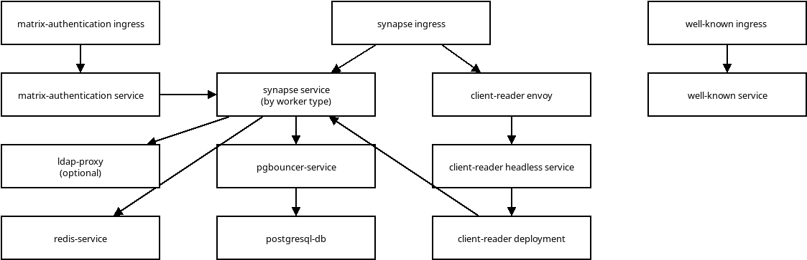

# Matrix-Stack


## Helm repository

```
helm repo add code-tool https://code-tool.github.io/matrix-stack/
```


## Charts overview

1. `synapse` - for setting up matrix workers, MAS, sliding-sync, admin component
1. `ldap` - for setting up LDAP proxy
1. `sentry-webhook` - for webhook from sentry to matrix chat
1. `webhook` - for webhook from slack-compatible clients to matrix chat
1. `matrix-alertmanager-receiver` - for webhook from Prometheus Alertmanager to matrix chat
1. `livekit-jwt` - for LiveKit management service
1. `compress-state` - experimental tools that attempt to reduce the number of rows in the state_groups_state table inside of a Synapse Postgresql database


## Visualisation


