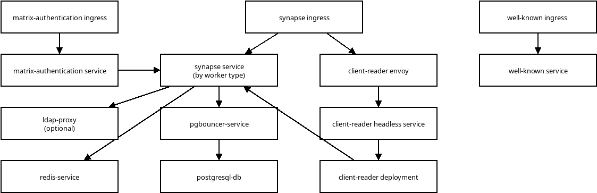

# Matrix-Stack


## Helm repository

```
helm repo add code-tool https://code-tool.github.io/matrix-stack/
```


## Charts overview

1. `synapse` - for setting up matrix workers, MAS, sliding-sync, admin component
1. `ldap` - for setting up LDAP proxy
1. `sentry-webhook` - for webhook from sentry to matrix chat
1. `webhook` - for webhook from slack-compatible clients to matrix chat
1. `matrix-alertmanager-receiver` - for webhook from Prometheus Alertmanager to matrix chat
1. `livekit-jwt` - for LiveKit management service
1. `compress-state` - experimental tools that attempt to reduce the number of rows in the state_groups_state table inside of a Synapse Postgresql database


## Visualisation



## Synapse worker architecture

The core of synapse monolith distribution is complex regexp routing to particular workers.

Worker types

### synapse.app.generic_worker

Most common worker type: can read data, respond to HTTP API, client and federation requests. Has no streams and cannot write any stream by itself.

A generic worker can be:
- reader - client_reader, federation_reader, sync, room
- stream writer - if configured in the stream_writers section
- both simultaneously

generic_worker is not an architecture type - it is a behavior type determined by config.

### Stream writer

Not a separate app type - this is a role for a generic worker when it is listed in stream_writers. The stream writer owns a Redis stream exclusively; other workers write to that stream by
sending HTTP requests to it.

Requirements:
- must be in instance_map
- must have a replication listener (port 9093)

Singleton streams (one writer only): typing, to_device, account_data, presence, push_rules

Scalable streams (round-robin across multiple writers): receipts, device_lists, thread_subscriptions, quarantined_media, events

### synapse.app.media_repository

The only distinct worker app type, different from generic_worker:
- uses media-specific headers
- responds to /_matrix/media/, /_matrix/client/v1/media/, /_matrix/federation/v1/media/
- can have a background job: media_instance_running_background_jobs
- cannot be a stream writer
- cannot respond to any client/federation endpoints

### Background jobs

Generic workers with no HTTP endpoints:
- background - singleton; stats, media cleanup, user directory updates
- pusher - pusher_instances: [pusher1, pusher2]; sends push notifications
- federation_sender - federation_sender_instances: [sender1, sender2]; outbound federation only

Worker reference table

 --------------------------------------------------------------------------------------------------------
 | worker                                     | type          | scalable | possible lb algo     | http  |
 --------------------------------------------------------------------------------------------------------
 │ typing                                     │ stream writer │ no       │ -                    │ yes   |
 │ to_device                                  │ stream writer │ no       │ -                    │ yes   |
 │ account_data                               │ stream writer │ no       │ -                    │ yes   |
 │ presence                                   │ stream writer │ no       │ -                    │ yes   |
 │ push_rules                                 │ stream writer │ no       │ -                    │ yes   |
 │ receipts                                   │ stream writer │ yes      │ round-robin          │ yes   |
 │ device_lists                               │ stream writer │ yes      │ round-robin          │ yes   |
 │ thread_subscriptions                       │ stream writer │ yes      │ round-robin          │ yes   |
 │ quarantined_media                          │ stream writer │ yes      │ round-robin          │ yes   |
 │ events (persister)                         │ stream writer │ yes      │ shard by room_id     │ yes   |
 │ media_repository                           │ app           │ yes      │ least_conn           │ yes   |
 │ media_instance_running_background_jobs     │ app           │ no       │ no                   │ no    |
 │ room_worker                                │ generic       │ yes      │ hash by room_id      │ yes   |
 │ sync_worker                                │ generic       │ yes      │ hash by user_id      │ yes   |
 │ federation_reader                          │ generic       │ yes      │ hash by source ip    │ yes   |
 │ client_reader                              │ generic       │ yes      │ least_conn           │ yes   |
 │ user_dir                                   │ generic       │ no       │ -                    │ yes   |
 │ background_worker                          │ generic       │ no       │ -                    │ no    |
 │ pusher                                     │ generic       │ yes      │ shard by user        │ no    |
 │ federation_sender                          │ generic       │ yes      │ shard by destination │ no    |
